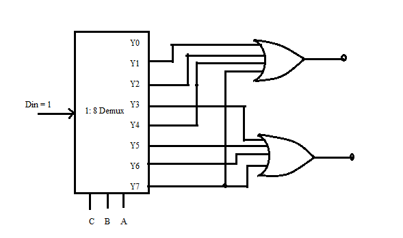

## <b> Post-test</b>
#### Please attempt the following questions

<pre>
1) To implement multiple output functions (sum of product type-SOP) using demultiplexer, additional __________type of gates are required.
    a.AND
    <b>b.OR</b>
    c.NOT
    d.XOR

2) Design, construct and verify a 1:2 demux using NOR gates only. Get the simulation results evaluated by your faculty.

3) Can 1:4 demux chips be cascaded to build 1:8 demux?
    <b>a.Yes</b>
    b.No

4) To implement a full adder, which of the following demux would be preferable?
    a.1:4 
    <b>b.1:8</b>
    c.1:16
    d.1:32

5) The figure shown below represents____________.

    a.half adder
   <b> b.full adder</b>
    c.half subtractor
    d.full subtractor

</pre>