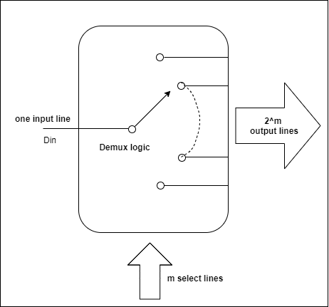
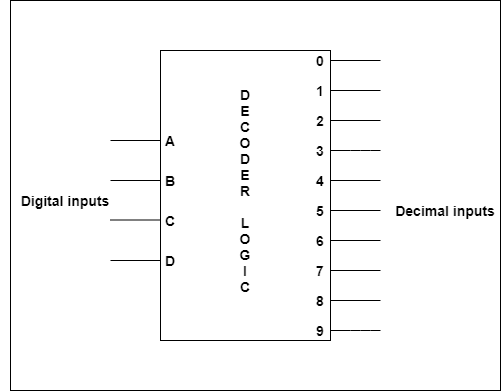
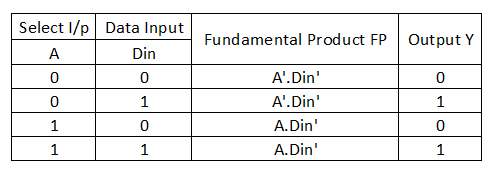
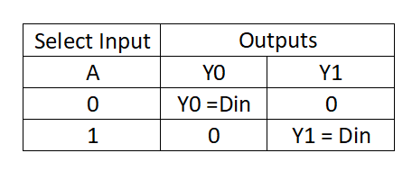
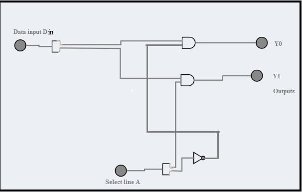
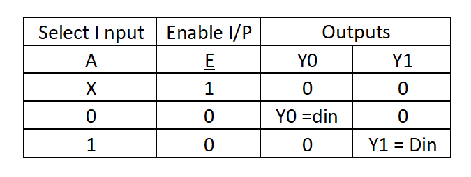
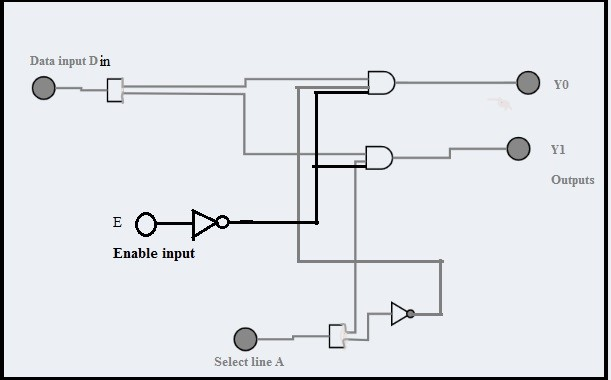

<justify>
<b>
1.1. Introduction
</b>
 
 
In certain applications, there is a need to connect the output of a system to a number of different destinations, but one at a time. In such cases, we need a digital combinational circuit called a demultiplexer. A demultiplexer is a logic circuit with one input and multiple outputs. It connects a single data input line to one of the 2^m output lines based on the status of the (m) select lines as shown in the figure.

 
 

 

On the other hand, a decoder is a logic circuit that accepts a 4-bit binary number and indicates its decimal equivalent(between 0 & 9) at the output as shown in the figure.

 

 

Commercially, demultiplexers ICs(integrated circuits) are available in form 1-to-2, 1-to-4, 1-to- 8 or 1-to-16 where the number of select lines is 1,2,3,4 respectively.
The same ICs, when used as decoders, are referred to as 1:2, 2:4, 3:8, 4:16 …..(m:2^m). The demux/decoder circuits can be designed easily using gates-small scale integration SSI ICs for a small number of select lines. If the size of the demux/decoder increases, using medium-scale integration (MSI) ICs is the right choice. TTL IC 74154 is a 1-to-16 demultiplexer IC. In this experiment, we focus our attention on designing demux using gates.

<b>1.2. Design of 1-to-2 demux using basic logic gates</b>
 

A simple 1-to-2 demux will have single data input line Din and one select line A and two outputs Y0 & Y1.
The select line can take a value either 0 or 1: 
a.	If A takes a value 0, the input Din is passed to the selected output Y0. i.e Y0 = D. 
b.	If A takes a value 1, the input Din is connected to the selected output Y1. i.e. Y1 = Din.

 

 

<b>Function table</b>

The expressions for outputs Y0 & Y1 can be formulated by considering only those FPs for which the output is 1. 
Y0 = A’. Din 
Y1 = A . Din

The simplified function can be tabulated as:

 

 

Using basic logic gates a 1:2 demux can be constructed as shown in the figure.

 

 

An active low enable input may also be applied to the circuit to enable/disable it. The simplified function can be tabulated as:

 

 

 

 

</justify>