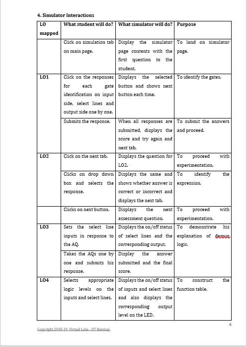
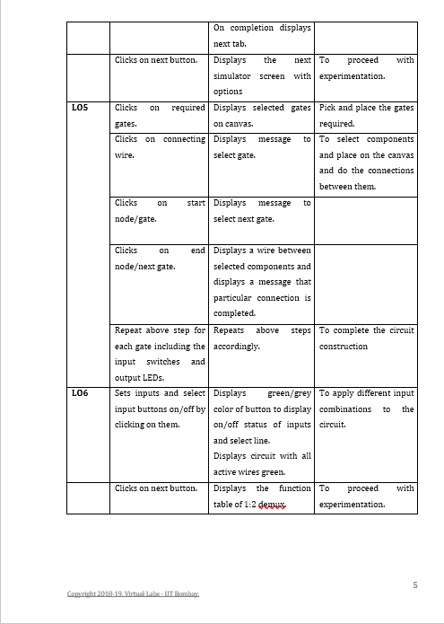
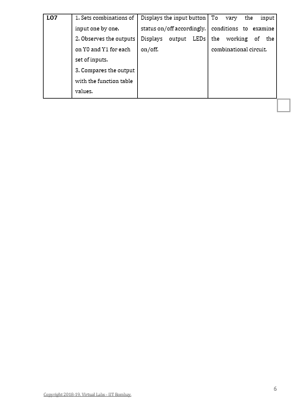

# **Development of Virtual Lab : Round 1 (R1)**
**Name of Faculty**: Prof. Mrs Tanuja Sachin Khatavkar  
**Institute**: PVG’s College of Engineering & Technology, Pune-09  
**Email ID**: tanutsk@gmail.com  
**Discipline to which the Lab belongs**: Electronics & Communication  
**Name of the Lab**: Digital Logic Design Using Gates  
**Name of Experiment**: : Design of demultiplexer circuit using logic gates.

  Kindly refer these documents before filling the worksheet  

**1. Guidelines** :  
a. Handout for R1 Overall Summary : http://bit.ly/Vlabs-Dev_Handout_Summary_R1   
b. Handout R1 for topics 1 & 2 : http://bit.ly/Vlabs-Dev_Handout_1_R1  
c. Handout R1 for topics 3 & 4:  http://bit.ly/Vlabs-Dev_Handout2_R1  
d. Presentation  on Learning Objectives: http://bit.ly/Vlabs-Dev_LO-ppt  
**2. Samples of R1** :  
Fluid-Mechanics: : http://bit.ly/Fluid-Mech_R1_Sample  
Digital-Electronics-Lab:  http://bit.ly/Digital_elec_R1_Sample  
Numerical-Methods-Lab:  http://bit.ly/Numerical-Method_R1_Sample  

##  1.1 FOCUS AREA : Experimentation
### 1.2 About the Experiment :
A demultiplexer is a logic circuit with one input and multiple outputs. It connects a single data input line to one of the 2^m output lines based on the status of the (m) select lines. The students will be able to understand the concept of demultiplexers/decoders and its implementation using combinations of basic logic gates.

### 1.3 Learning Objectives & Cognitive Levels :

|Sr. No. |Learning Objective |Cognitive Level |Action Verb|
|--------|-------------------|----------------|-----------|
| 1. | Students will be able to identify the type of gates required for 1:2 demultiplexer | Remember | Identify  |
| 2. | Students will be able to identify the Boolean expression for the 1:2 demultiplexer. |  Remember  | Identify |
| 3. | The student will be able to explain the role of demultiplexer in a water dispenser system. | Apply | Explain |
| 4. | The student will be able to construct the function table of the operation of a 1:2 demux.  | Apply | Construct |
| 5. | The student will be able to pick and place the required gates on canvas and construct the 1:2 demux logic. | Apply | Construct |
| 6. | The student will be able to apply appropriate combinations of enable, select and inputs to the 1:2 demux circuit. | Apply | Apply |
| 7. | The students will be able to examine the truth table of decoder and verify the same.|Analyze|Examine |

## 2.1. Instructional Strategy : Problem Based
### 2.2. Assessment Method : Formative Assessment
### 2.3. Description of sections :
It is proposed to design this experiment using a generalized simulator. The simulator would be a framework that provides logic gates, switches, LEDs and wire options, reset, simulate and pick and place features. These features would enable the students to construct, simulate and verify their digital logic designs. 

## 3. Task & Assessment Questions
 Complete the following table with details of the various tasks and assessment questions you will give to the students.

 |Sr No.| Learning Objective to be met | Tasks to be performed by the students | Assessment questions aligned to the task |
 |-------|-----|------|--------|
 | 1.|Students will be able to identify the type of gates required for 1:2 demultiplexer|Identify the gates necessary for 1:2 demux in the dropbox.|Questions to identify the type of gates required for 1:2 demux.|
 | 2. |Students will be able to identify the Boolean expression for the 1:2 demultiplexer.|Identifies the output expression from the drop down list. |Question to identify the output expression. |
 | 3. |The student will be able to explain the role of demultiplexer in a water dispenser system. |Select the appropriate control input conditions/output required and observes the circuit behavior. |Questions based on function table of demux application as a water dispenser.|
 |4. |The student will be able to construct the function table of the operation of a 1:2 demux. |Prepare the function table. |Questions based on function table creation.|
 |5.| The student will be able to pick and place the required gates on canvas and construct the 1:2 demux logic.|Student picks and places the required gates on the canvas and makes the appropriate connections.| Pick and place and connect. |
| 6. |The student will be able to apply appropriate combinations of enable, select and inputs to the 1:2 demux circuit.|Student applies various 1/0 combinations at select and input lines by clicking on the buttons. |Change the input/select line conditions for the combinational circuit.|
| 7. | The students will be able to examine the truth table of demux and verify the same.	| Student examines the working of demux by setting conditions given in the function table.| |

## Simulator Interactions
 

 

 

